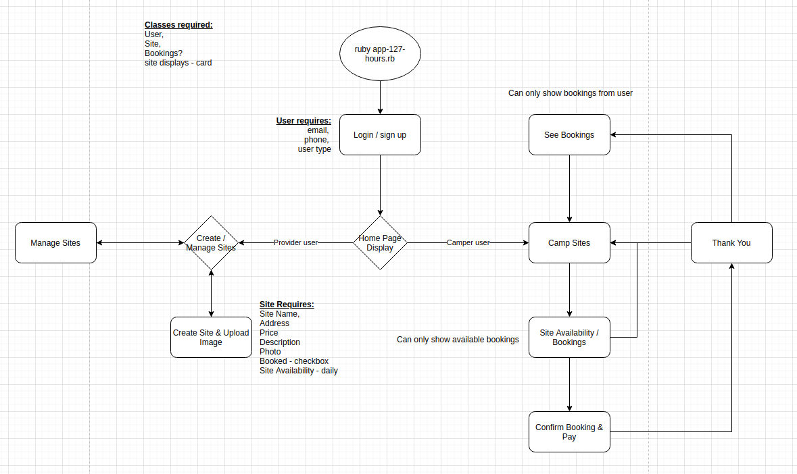

# README

## R7	Identification of the problem you are trying to solve by building this particular marketplace app.

Camp site owners often have issues keeping track of which sites have been booked and which haven't. 

Camp site owners also have high human resource costs for managing bookings and payments. 

Campers struggle to know which camp sites are available without having to ring each site individually and often are unaware that sites even exist.

127 Hours allows camp site owners to manage their bookings in an orderly fashion, take payment without requireing customer's financial details and reduce administration costs, all without having to deal with the customers directly.

From the customer's point of view, 127 Hours allows them to search for available sites, check availability and pricing of each site from one location, manage the; order, booking and payment, all from one location online. 

## R8	Why is it a problem that needs solving?

The cost of losing a booking and searching for files can take days out of the camp site owner's life when accumulating across the year, it increases stress levels and reduces their ability to maintain their sites. Many sites employ staff to simply manage the administration of these tasks which is costly to the business and has even seen many sites shut down in recent years.

Many campers will simply change their mind and do another activity instead of camping which is hurting the industry as well as the consumer.

## R9	A link (URL) to your deployed app (i.e. website)

https://app127rock.herokuapp.com/

## R10	A link to your GitHub repository (repo).

https://github.com/matt-john-kennedy/app127rock

## R11	Description of your marketplace app (website), including:

### Purpose

The purpose of this site is to allow for freeflowing information between campers and campsite owners while minimising or even eliminating the requirement for communication. It also reduces the possibility for errors while providing ease to both parties.

### Functionality / features

Camp site owners are able to add their sites and details of each site, view bookings made, take payment from the camper and monitor the usage of their sites all from one location.

Campers are able to search for available sites, view the details of the sites, book the days they want at the available sites and pay for it online.

### Sitemap

### Screenshots

### Target audience

This app is aimed at camp site owners looking to; gain more customers, streamline their administration process, provide details of their site, reduce human resource costs or simply just get with the times.

It is also aimed at campers who are looking for their next camping vacation or to book at a place they've already enjoyed.

### Tech stack (e.g. html, css, deployment platform, etc)

- Ruby

Ruby is a programming language focussed on making programming easier for the programmer. It focusses on using more common day language to make code more readable and became more popular with the development of the Rails Framework

- Rails

Rails is a framework for interacting with the web which utilises the Model-View-Controller (MVC) structure. The logic for the web applications are divided into 3 different sections (one each for the Model, View and Controller) where they interact with each other. The user interacts with the browser which sends information to the controller, the controller manipulates the model and sometimes directly updates the view. The model updates the view with the logic of how the app should opperate. The View controls what the user sees on the browser and is how the user interacts with the controller.

- Git

- Github

- Postgresql

PostreSQL is a relationsl database database management system which utilises SQL to manipluate the data within it. Data is organised into tables and referenced through it's primary key which is also stored as a secondary key in the database table that will be accessing it. 

- html

- scss/css

## R12	User stories for your app

We're so glad that we have started using this app for our campsite managament. It has enabled us to give our patrons more attention while onsite and we've increased the number of bookings while ensuring we get paid for each booking which has been an issue for us in the past. - John Doe "camps are us"

"I've camped around Australia before but this app has introduced me to new locations and made vacation planning extremely easy. We're able to check out sites before going there and we never have to worry about the location being overbooked when we arrive. - Hannah Montanna 

## R13	Wireframes for your app

## R14	An ERD for your app

## R15	Explain the different high-level components (abstractions) in your app

### Site Owner

The Site owner is a user within the app and it is given the functionality of being able to control and view site locations, it has the CRUD functionality for Site locations and it's own properties. 

### Camper

Campers are also users within the app, they are given the full CRUD functionality for their own details and is able to Update details for a site to show when they are accessing it and create a booking

### Site Locations

Site locations are accessed by the Site owners and Campers when being created and edited by the site owners or when being booked by the camper. Bookings access the site locations to update the details as a reference to the order of the camper.

## R16	Detail any third party services that your app will use

### Stripe

Stripe is a payments processing platform which is PCI Compliant (Payment Card Industry Compliant) - it meets the Data Security Standard, which is a requirement for any site that takes payment details online through any of the major debit/credit cards to ensure protection for secure payments to take place. It is widely used by many companies and removes the risk of the data being used for nefarious means.

### Heroku

Heroku is a platform as a service that manages the server and application installation on their end, it is directly more costly than managing your own server but it is indirectly less expensive as clients of their platform do not need to dedicate staff for the purpose of maintaining the server or their applications 

## R17	Describe your projects models in terms of the relationships (active record associations) they have with each other

## R18	Discuss the database relations to be implemented in your application

## R19	Provide your database schema design

## R20	Describe the way tasks are allocated and tracked in your project